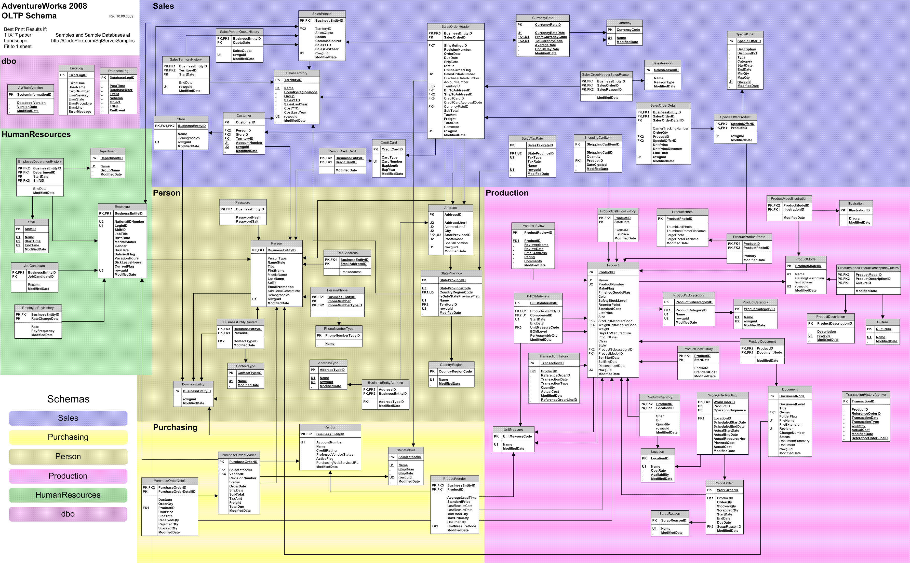

# AdventureWorks

## Summary

I use this repository to exhibit my sql skills.

## Tools used

1. OS: Windows 10
2. SQL Server
3. SQL Server Management Studio
4. [AdventureWorks2014](https://docs.microsoft.com/en-gb/sql/samples/adventureworks-install-configure?view=sql-server-ver15&tabs=ssms) sample database

## Database diagram

The diagram portrays the AdventureWorks2008 database, but no major changes have been detected in the 2014 version when carrying out the exercices.

## Exercices

List of exercises by folder:

### SQL Folder

|Num|Question|Query|Outcome|
|:-:|:-------|:---:|:-----:|
|1|Show the first name and the email address of customer with CompanyName 'Bike World'|[see](SQL/Queries/Q1_Level_1.sql)|[see](SQL/Outcomes/Q1_Level_1.csv)|
|2|Show the CompanyName for all customers with an address in City 'Dallas'|[see](SQL/Queries/Q2_Level_1.sql)|[see](SQL/Outcomes/Q2_Level_1.csv)|
|3|How many items with ListPrice more than $1000 have been sold?|[see](SQL/Queries/Q3_Level_1.sql)|[see](SQL/Outcomes/Q3_Level_1.csv)|
|4|Give the CompanyName of those customers with orders over $100000.|[see](SQL/Queries/Q4_Level_1.sql)|[see](SQL/Outcomes/Q4_Level_1.csv)|
|5|Find the number of left racing socks ('Racing Socks, L') ordered by CompanyName 'Riding Cycles'|[see](SQL/Queries/Q5_Level_1.sql)|[see](SQL/Outcomes/Q5_Level_1.csv)|
|6|A "Single Item Order" is a customer order where only one item is ordered. Show the SalesOrderID and the UnitPrice for every Single Item Order.|[see](SQL/Queries/Q6_Level_2.sql)|[see](SQL/Outcomes/Q6_Level_2.csv)|
|7|Where did the racing socks go? List the product name and the CompanyName for all Customers who ordered ProductModel 'Racing Socks'|[see](SQL/Queries/Q7_Level_2.sql)|[see](SQL/Outcomes/Q7_Level_2.csv)|
|8|Show the product description for culture 'fr' for product with ProductID 736.|[see](SQL/Queries/Q8_Level_2.sql)|[see](SQL/Outcomes/Q8_Level_2.csv)|
|9|Use the SubTotal value in SaleOrderHeader to list orders from the largest to the smallest. For each order show the CompanyName and the SubTotal and the total weight of the order.Assuming that we just want to show B2B sales; Thus, a customer needs to have a shop registered in the DB.|[see](SQL/Queries/Q9_Level_2.sql)|[see](SQL/Outcomes/Q9_Level_2.csv)|
|10|How many products in ProductCategory 'Cranksets' have been sold to an address in 'London'?|[see](SQL/Queries/Q10_Level_2.sql)|[see](SQL/Outcomes/Q10_Level_2.csv)|
|11|For every customer with a 'Main Office' in Dallas show AddressLine1 of the 'Main Office' and AddressLine1 of the 'Shipping' address - if there is no shipping address leave it blank. Use one row per customer.|[see](SQL/Queries/Q11_Level_3.sql)|[see](SQL/Outcomes/Q11_Level_3.csv)|
|12|For each order show the SalesOrderID and SubTotal calculated three ways: A) From the SalesOrderHeader B) Sum of OrderQty*UnitPrice|[see](SQL/Queries/Q12_Level_3.sql)|[see](SQL/Outcomes/Q12_Level_3.csv)|
|13|Show the best selling item by value. Assuming all totals are in dollars|[see](SQL/Queries/Q13_Level_3.sql)|[see](SQL/Outcomes/Q13_Level_3.csv)|
|14|Show how many orders are in the following ranges (in $): 0-99, 100- 999, 1000-9999 10000-.Assuming all totals are in dollars|[see](SQL/Queries/Q14_Level_3.sql)|[see](SQL/Outcomes/Q14_Level_3.csv)|
|15|Identify the three most important cities. Show the break down of top  level product category against city. Assuming all totals are in dollars|[see](SQL/Queries/Q15_Level_3.sql)|[see](SQL/Outcomes/Q15_Level_3.csv)|
